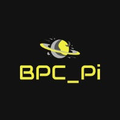

.. BPC_Pi documentation master file, created by
   sphinx-quickstart on Thu Feb 13 10:25:57 2020.
   You can adapt this file completely to your liking, but it should at least
   contain the root `toctree` directive.

About us!
==================================

.. py:function:: About our team

   We are a team of 6 people from `Lucian Blaga High School <http://www.liceulblagacluj.ro/>`_
   in the city of Cluj-Napoca, Romania.

.. py:function:: What are we doing?

   Our experiment consists of the following:
      * Constantly monitoring the
         - Temperature
         - Humidity
         - Pressure
         - Data from the Acceleromter / Gyroscope
      * Saving the data to a datalogger
      * We measure the distance between the ISS and the Earth
   Based on the data we gather we are going to make a report about the long-term effects that the astronauts may experience. 

Source code | Repository
==================================
 Our entire project is available on `Github <https://github.com/davidp-ro/BPC_Pi>`_

Documentation
==================================

.. py:function:: steag(nr_afisari, delay)
   
   *nr_afisari*: How many times should the flag wave

   *delay*: Delay between the waves

   This function shows the flag right at the begggining.

.. py:function:: get_show_data(scrl_spd, col_t, col_h, col_p, bk_t, bk_h, bk_p)

   *scrl_spd*: Speed of the scrolling text

   *col_t*: Text colour for the temperature

   *col_h*: Text colour for the humidity

   *col_p*: Text colour for the pressure

   *bk_t*: Background colour for the temperature

   *bk_h*: Background colour for the humidity

   *bk_p*: Background colour for the pressure

   This is our function for collecting the data from the sensors,
   and also showing it on the LED Matrix.

.. py:function:: logger()

   This function is saving the relevant data in the data01.csv file 
   and it also gets the height of the ISS. 

Our team!
==================================

   Pescariu David

   Mates Dragos

   Rotar Rafael

   Pop Rares

   Gadalean Tudor

   Cuibus Dorin